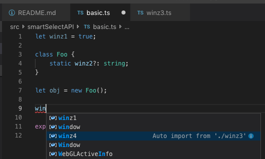
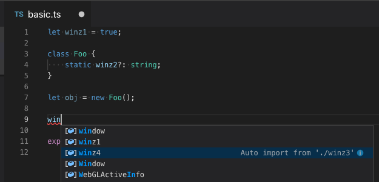

# TypeScript v3.5.1 変更点

こんにちは[メルペイ社](https://www.merpay.com/)な[@vvakame](https://twitter.com/vvakame)です。

[TypeScript 3.5](https://devblogs.microsoft.com/typescript/announcing-typescript-3-5/)がアナウンスされました。
[RC](https://devblogs.microsoft.com/typescript/announcing-typescript-3-5-rc/)のときのアナウンスはこちら。

RCが出たなーと思っていたらあれよあれよと時間が…。

* [What's new in TypeScript in 3.5](https://github.com/Microsoft/TypeScript/wiki/What's-new-in-TypeScript#typescript-35)
* [Breaking Changes in 3.5](https://github.com/Microsoft/TypeScript/wiki/Breaking-Changes#typescript-35)
* [TypeScript 3.5 Iteration Plan](https://github.com/microsoft/TypeScript/issues/30555)
* [TypeScript Roadmap: January - June 2019](https://github.com/Microsoft/TypeScript/issues/29288)

Roadmapは[こちら](https://github.com/Microsoft/TypeScript/wiki/Roadmap#35-may-2019)。

[この辺](https://github.com/vvakame/til/tree/master/typescript/v3.5.1)に僕が試した時のコードを投げてあります。

## 変更点まとめ

* コンストラクタと高階化推論 [Higher order inferences for constructor functions](https://github.com/Microsoft/TypeScript/pull/31116)
    * 訳語があってるか全然わからん
    * 関数の引数に、型パラメータが1個あるような関数またはコンストラクタを渡すと返り値の型が推論に利用される
        * という意味だと思うけど複雑ですね
* ある値をユニオン型の変数に割り付ける時の制約の緩和 [Easier assignment to discriminated unions](https://github.com/Microsoft/TypeScript/pull/30779)
    * ある一定の複雑度までであれば、ユニオン型の変数への代入について互換性チェックが行われるようになった
* 型パラメータで実際の型がわからんかった時 `{}` に推論されてたのを `unknown` にする [Change default constraint for type parameters from `{}` to `unknown`](https://github.com/Microsoft/TypeScript/pull/30637)
    * 安全側に倒した感じですね
    * もちろんBreaking Changeです(semverあげて💕)
* 添字によるアクセスの時の型チェックをより厳密に [Improved checking of indexed access types](https://github.com/microsoft/TypeScript/pull/30769)
    * invalidなコード or invalidな可能性が高いコードを書けていたのが検出されるようになった
* `Omit` 型が追加された [The `Omit` helper type](https://github.com/Microsoft/TypeScript/pull/30552)
    * `type Omit<T, K extends keyof any> = Pick<T, Exclude<keyof T, K>>;`
* `--allowUmdGlobalAccess` の追加 [`--allowUmdGlobalAccess` to use UMD globals from modules](https://github.com/Microsoft/TypeScript/pull/30776)
    * `--allowUmdGlobalAccess` がついてるとmoduleの中でimportせずともグローバルに露出しているUMDのシンボルにアクセス可能になる
    * `export as namespace foo` はTypeScript 2.0で追加されたやつ
* `--noEmitOnError` と `--isolatedModules` が併用できるようになった [`--noEmitOnError` with `--isolatedModules`](https://github.com/microsoft/TypeScript/pull/31043)
    * そのまんま
* モジュールの解決結果をキャッシュすることによりビルド高速化 [Caching module resolution results](https://github.com/Microsoft/TypeScript/pull/31100)
    * Speed improvements in `--incremental` and `--build` の一環
    * プロジェクトに参照が含まれていて同じオプションの時… らしいので恩恵を受けられる範囲は狭そう
* tsconfig.jsonのパース結果をキャッシュするようにした [Caching results of parsing tsconfig.json](https://github.com/Microsoft/TypeScript/pull/31101)
    * Speed improvements in `--incremental` and `--build` の一環
    * 1個上のと組み合わせてかなり高速化したようだ
* 入力補完候補のソート順を賢くした [Sorted/prioritized completions](https://github.com/Microsoft/TypeScript/issues/15024)
    * より関係性が高いものを上位に出すように
    * ローカルなスコープにあるもの, クラスのメンバ, グローバルスコープ&キーワード, importのサジェスト, JSからの識別子
* VSCodeのSmart Select APIへの対応 [Smart Select API](https://github.com/Microsoft/TypeScript/issues/29071)
    * 選択箇所のexpandのこと
    * [VSCode側](https://github.com/microsoft/vscode/issues/63935)
* 型を切り出すリファクタリングの追加 [Refactoring to extract type](https://github.com/Microsoft/TypeScript/issues/23869)
    * `Extract to type alias`
        * 選択箇所をtype aliasとして切り出す
    * `Extract to typedef`
        * JS用のやつ
* intersection typesやunion typesで余計なプロパティのチェックを行うようにした [Perform excess property checking on intersection and union members](https://github.com/microsoft/TypeScript/pull/30853)
    * 余計な値の検出がより厳密に行われるようになった…はず
* ES5で `Object.keys` にプリミティブ型の値を投げ込むのを禁止した [ES5 Object.keys only accepts an object](https://github.com/microsoft/TypeScript/pull/27089)
    * ES5だと例外が投げられるので ES2015以降だと `[]` が返ってくるのでOK

## 破壊的変更！

* 型パラメータで実際の型がわからんかった時 `{}` に推論されてたのを `unknown` にする
* `{ [k: string]: unknown }` が特別扱いされなくなった
    * 今までは `{ [k: string]: any }` と同じ扱いだった
    * 1個目の破壊的変更によりそのままだと困るケースが発生するようになったので変えた
* union typesでの余計なプロパティのチェックの改善
    * union typesの各要素を考慮し余計かどうか判断するようにした
* 添字によるアクセスの時の型チェックをより厳密に
* `Omit` 型の追加
* ES5で `Object.keys` にプリミティブ型の値を投げ込むのを禁止した

## コンストラクタと高階化推論

TypeScript 3.4であった[Genericsの型の推論が強化された](https://qiita.com/vvakame/items/7f4a55fe15fc9bbe1a63#generics%E3%81%AE%E5%9E%8B%E3%81%AE%E6%8E%A8%E8%AB%96%E3%81%8C%E5%BC%B7%E5%8C%96%E3%81%95%E3%82%8C%E3%81%9F)の続編らしいです。
言語化して説明するのが重たいです。

TypeScript 3.4でできるようになったことをおさらいします。

```ts
// TypeScript v3.4 でできるようになったやつ
function box<T>(value: T) {
    return {
        kind: "box" as const,
        value,
    };
}
function bag<T>(value: T) {
    return {
        kind: "bag" as const,
        value,
    };
}

function composeFunc<T, U, V>(
    f1: (x: T) => U,
    f2: (y: U) => V,
): (x: T) => V {
    return x => f2(f1(x));
}

let f1 = composeFunc(box, bag);
let a1 = f1(42);
// TypeScript v3.4 でこれがコンパイルエラーにできるようになった
// a1.value.value = "string";
```

次に、今回できるようになったことを見てみます。

```ts
// TypeScript v3.5 でできるようになったやつ
class Box<T> {
    kind: "box" = "box";
    constructor(public value: T) { }
}

class Bag<U> {
    kind: "bag" = "bag";
    constructor(public value: U) { }
}

function composeCtor<T, U, V>(
    C1: new (x: T) => U,
    C2: new (y: U) => V,
): (x: T) => V {
    return x => new C2(new C1(x));
}

// f2 は <T>(x: T) => Bag<Box<T>> になる
// v3.4 までは (x: {}) => Bag<{}> であった
let f2 = composeCtor(Box, Bag);
let a2 = f2(42);

// TypeScript v3.4.5 Property 'value' does not exist on type '{}'.
a2.value.value;

// TypeScript v3.5.1 Type '"string"' is not assignable to type 'number'.
// a2.value.value = "string";
```

高階化された型推論の範囲がコンストラクタにまで拡張されたわけです。
これが何に嬉しいかというと、ReactなどでのUIライブラリなどで[HoC](https://reactjs.org/docs/higher-order-components.html)が書きやすくなる…という感じだそうな。

```ts
type ComponentClass<P> = new (props: P) => Component<P>;
declare class Component<P> {
    props: P;
    constructor(props: P);
}

type Route = { route?: string[]; };
declare function myHoC<P>(C: ComponentClass<P>): ComponentClass<P & Route>;

type NestedProps<T> = { foo: number, stuff: T };
declare class GenericComponent<T> extends Component<NestedProps<T>> {
}

// MyComponent の型は
//   new <T>(props: NestedProps<T> & Route) => Component<NestedProps<T> & Route>
//     となる
// TypeScript v3.4 では
//   ComponentClass<NestedProps<{}> & Route>
//     だった
const MyComponent = myHoC(GenericComponent);
const c1 = new MyComponent({
    foo: 42,
    stuff: {
        name: "bar",
    },
});

c1.props.foo;
c1.props.stuff;
// TypeScript 3.5 ではちゃんと型が推論できる
// 3.4では error TS2339: Property 'name' does not exist on type '{}'.
c1.props.stuff.name;
c1.props.route;
```

`typeof MyComponent` が `ComponentClass<NestedProps<T> & Route>` に評価されないのはあと一歩感があります。

## ある値をユニオン型の変数に割り付ける時の制約の緩和

値の代入先の型がユニオン型の場合、いずれか1つの型に完全にマッチしている必要がありました。
この制限が緩和され、各要素について代入可能か検討され、制限を満たすか計算されるようになりました。

```ts
type T0 = { done: false, value: number };
type T1 = { done: true, value: number };
type T = T0 | T1;

let target: T;

// T0 を満たすのでコンパイルが通る
target = { done: true, value: 1 };
// T1 を満たすのでコンパイルが通る
target = { done: false, value: 1 };

// done が true とも false とも決まっていない bool の場合は…
type S = { done: boolean, value: number };
let source: S = { done: true, value: 1 };

// TypeScript v3.4 までは
//   error TS2322: Type 'S' is not assignable to type 'T'.
//     Type 'S' is not assignable to type 'T1'.
//       Types of property 'done' are incompatible.
//         Type 'boolean' is not assignable to type 'true'.
// TypeScript v3.5 ではコンパイルできる！
//   S と T0 を比べた結果 { done: false, value: number } の可能性は回収された！
//   残る T1 と比べた結果 { done: true, value: number } の可能性も回収された！
//   S が取りうる全ての可能性が回収されたので S と T は互換性があることがわかった
target = source;
```

コンパイルに(正しく)失敗するパターンも見てみます。

```ts
// done に null のパターンを追加
type S = { done: boolean | null, value: number };
type T =
    | { done: true, value: number }     // T0
    | { done: false, value: number };   // T1
    // | { done: null, value: number }  ← この可能性が残る

let s: S = { done: true, value: 1 };
let t: T;

// この S の定義だと done: null のパターンがケアされないので T と互換ではない
// error TS2322: Type 'S' is not assignable to type 'T'.
//   Type 'S' is not assignable to type '{ done: false; value: number; }'.
//     Types of property 'done' are incompatible.
//       Type 'boolean | null' is not assignable to type 'false'.
//         Type 'null' is not assignable to type 'false'.
// t = s;
```

もう1パターン見てみます。
組み合わせが爆発するのを防ぐため、判別可能な型の組み合わせは現時点で25パターンまでに制限されています。

```ts
// 判別可能な型の組み合わせは25パターンまで…
//   Nで3パターン、Sで3プロパティがあり、3×3×3の27パターン…
//   今回の仕組みは作動しない
type N = 0 | 1 | 2;
type S = { a: N, b: N, c: N };
type T = { a: 0, b: N, c: N }
    | { a: 1, b: N, c: N }
    | { a: 2, b: N, c: N }
    | { a: N, b: 0, c: N }
    | { a: N, b: 1, c: N }
    | { a: N, b: 2, c: N }
    | { a: N, b: N, c: 0 }
    | { a: N, b: N, c: 1 }
    | { a: N, b: N, c: 2 };

let s: S = void 0 as any;
let t: T

// この場合 S は T に割付可能だが組み合わせが複雑なので怒られる
// error TS2322: Type 'S' is not assignable to type 'T'.
//   Type 'S' is not assignable to type '{ a: 0 | 2 | 1; b: 0 | 2 | 1; c: 2; }'.
//     Types of property 'c' are incompatible.
//       Type '0 | 2 | 1' is not assignable to type '2'.
//         Type '0' is not assignable to type '2'.
// t = s;
```

## 型パラメータで実際の型がわからんかった時 `{}` に推論されてたのを `unknown` にする

型パラメータの推論に失敗した時のデフォルトの型が `{}` から `unknown` に変更されました。
結構デカいBreaking Changeですね…。

公式で紹介されている理由としては次の通り。

* `{}` は文字列によるインデクスアクセス( `k["foo"]` )ができてしまう
    * これは `--noImplicitAny` 環境下ではエラーになる
    * `unknown` の場合そもそも型が不明なのでエラーになる（正しそう）
* `{}` の値として `null` または `undefined` は使えない
    * `unknown` は使える（正しい）
+ `{}` は `object` に代入可能
    * `unknown` はできない（正しい）

コード例としてはこんな感じ。

```ts
function foo1<T>(x: T): [T, string] {
    // TypeScript v3.5 ではエラー ベースが unknown なので
    // error TS2339: Property 'toString' does not exist on type 'T'.
    /// return [x, x.toString()];

    return [x, `${x}`];
}

foo1(null);

// extends {} で toString() が存在する制約を加える
// v3.4 以前と等価
function foo2<T extends {}>(x: T): [T, string] {
    return [x, x.toString()];
}

// null を渡そうとするとエラーとして検出できるようになった！
// error TS2345: Argument of type 'null' is not assignable to parameter of type '{}'.
// foo2(null);
```

これに合わせて、 `{ [k: string]: unknown }` が特別扱いされなくなったというBreaking Changeも入っています。
`{ [s: string]: any }` は今まで通り特別扱いで、objectであればなんでもアサインできるようになっていました。

```ts
// TypeScript v3.5 からダメになった
//   error TS2322: Type '() => void' is not assignable to type '{ [k: string]: unknown; }'.
// let obj1: { [k: string]: unknown } = () => {};

// これは今まで通り
let obj2: { [k: string]: any } = () => {};
```

これは今までは理にかなっていて、すべてのプロパティは `unknown` のサブタイプで、これはobjectな値全体に当てはまるはずでした。
しかし、型パラメータが `{}` が `unknown` に評価されるとすると、意図せず `{ [k: string]: unknown }` な型が生まれる可能性があります。
そうなると、型チェックの正確さが損なわれうるため、この変更が入りました。

```ts
declare function someFunc(): void;
declare function fn<T>(arg: { [k: string]: T }): void;

// TypeScript v3.4 までは
//   error TS2345: Argument of type '() => void' is not assignable to parameter of type '{ [k: string]: {}; }'.
//     Index signature is missing in type '() => void'.
//   と評価されたのでコンパイルエラーとして検出できた。
//   { [k: string]: {}; } が { [k: string]: unknown; } に変わると、v3.4 のルールのままだと取りこぼしてしまう
//
// TypeScript v3.5 でのエラーは次のように変わった
//   error TS2345: Argument of type '() => void' is not assignable to parameter of type '{ [k: string]: unknown; }'.
//     Index signature is missing in type '() => void'.
// fn(someFunc);
```

## 添字によるアクセスの時の型チェックをより厳密に

するようになったらしいです。
基本的にread(source side)の時は問題が起こりにくいし、そちらの使い方が大多数です。

```ts
// read の時はうまく動く
type A = {
    s: string;
    n: number;
};

function read<K extends keyof A>(arg: A, key: K): A[K] {
    return arg[key];
}

const a: A = { s: "", n: 0 };
// x は string となる
const x = read(a, "s");
```

一方、write(target side)の時は、型によるチェックをすり抜ける危険な操作ができてしまっていました。

```ts
// write の時は危ない操作ができてしまいがち
function write<K extends keyof A>(arg: A, key: K, value: A[K]): void {
    // TypeScript v3.4 ではエラーにならない
    // TypeScript v3.5 では
    //   error TS2322: Type '"hello, world"' is not assignable to type 'A[K]'.
    //     Type '"hello, world"' is not assignable to type 'string & number'.
    //       Type '"hello, world"' is not assignable to type 'number'.
    // arg[key] = "hello, world";
}
// n: number だが string の値に置き換えてしまえる
write(a, "n", 1);
```

Genericsの共変とか反変とかを思い出しますね(どっちがどっちだったか覚えてないけど)。

今回はこの挙動を修正したらしいです。
今まですり抜けていたけどv3.5から検出できるようになったパターンを見ていきます。

```ts
function f1(obj: { a: number, b: string }, key: keyof typeof obj) {
    // v の型は string | number 取得できる値としてはただしい
    let v = obj[key];

    // obj の a は number だし b は string...
    // 次の2つの代入はどちらかが型的に不正な変更になる

    // error TS2322: Type '1' is not assignable to type 'number & string'.
    // obj[key] = 1;
    // error TS2322: Type '"x"' is not assignable to type 'number & string'.
    // obj[key] = 'x';

    // type narrowing で key の値を確定させればエラーにならない
    if (key === "a") {
        obj[key] = 1;
    }
    if (key === "b") {
        obj[key] = 'x';
    }

    // こうもできてほしいがまぁできない
    if (typeof key === "number") {
        // obj[key] = 1;
    }
}

function f2(obj: { a: number, b: 0 | 1 }, key: keyof typeof obj) {
    // v の型は number 取得できる値としてはまぁそう
    let v = obj[key];

    // a は number だし b は 0 | 1
    // b に 2 を入れるのは不正だができてしまう！

    obj[key] = 1;
    // error TS2322: Type '2' is not assignable to type '0 | 1'.
    // obj[key] = 2;

    if (key === "a") {
        obj[key] = 2;
    }
}

function f3<T extends { [key: string]: any }>(obj: T) {
    // any な値が取れる
    let v1 = obj['foo'];
    let v2 = obj['bar'];

    // T は { [key: string]: any } を底にしているが実際は
    // { [key: string]: boolean; } などになりうる(わかるまで2-3分悩んだ)

    // error TS2536: Type '"foo"' cannot be used to index type 'T'.
    // obj['foo'] = 123;
    // error TS2536: Type '"bar"' cannot be used to index type 'T'.
    // obj['bar'] = 'x';
}
// f3の実装のままだとまずいような使い方
f3<{ [key: string]: boolean; }>({ foo: true });

function f4<K extends string>(a: { [P in K]: number }, b: { [key: string]: number }) {
    // K は型であり、 a のプロパティと b のプロパティは当然一致しない
    // error TS2322: Type '{ [key: string]: number; }' is not assignable to type '{ [P in K]: number; }'.
    // a = b;
    // しかし、今のところ逆はいいらしい いいのか？(よくない気がする) (自分の足を撃つ権利の範疇？)
    b = a;
    b["b"] = 4;
}
let arg1 = {
    a: 1,
    b: true,
};
let arg2 = {
    b: 2,
    c: 3,
}
// f4の実装のままだとまずいような使い方
f4<"a">(arg1, arg2);
```

なかなか厳しいですね…。

## `Omit` 型が追加された

まんまです。

```ts
type Omit<T, K extends keyof any> = Pick<T, Exclude<keyof T, K>>;
```

指定したプロパティを省いた型を返します。

```ts
type Cat = {
    kind: string;
    name: string;
    weight: number;
};

// T1 = { kind: string; name: string; }
type T1 = Omit<Cat, "weight" | "eyeColor">;
```

こんな感じですね。
キーの指定が `K extends keyof any` なので、存在しないプロパティも指定することができます。
typoに注意しましょう。

厳密にやりたかったら、自分で定義してしまったほうがいいかもしれませんね。

```ts
type OmitStrict<T, K extends keyof T> = Pick<T, Exclude<keyof T, K>>;

// error TS2344: Type '"weight" | "eyeColor"' does not satisfy the constraint '"weight" | "kind" | "name"'.
//   Type '"eyeColor"' is not assignable to type '"weight" | "kind" | "name"'.
// type T2 = OmitStrict<A, "weight" | "eyeColor">;
```

## `--allowUmdGlobalAccess` の追加

追加されたらしいです。
UMDなモジュールをimportせずにグローバルに公開されている名前経由でアクセスできるように指定します。

次のような定義があったとして…

```ts
export = foobar;
export as namespace foobar;

declare namespace foobar {
    var name: string;
}
```

普通ならCommonJS相当のモジュールとして次のように利用する

```ts
import * as foobar from "./foobar";

console.log(foobar.name);
```

が、 `--allowUmdGlobalAccess` アリだと次のようにも書ける。

```ts
// --allowUmdGlobalAccess 指定無しの場合次のエラーになる
// error TS2686: 'foobar' refers to a UMD global, but the current file is a module. Consider adding an import instead.
console.log(foobar.name);

export { }
```

まぁなるべくなら使わないほうがよいやつですね…。
というかUMDとかまだ使ってるやつおるんか…？(おるかも…？)

## `--noEmitOnError` と `--isolatedModules` が併用できるようになった

らしいです。

`--isolatedModules` はTypeScript 1.5.3で入ったはずだけど使った記憶がないな…。
single file transpileの制約がかかるので `--declaration`, `--composite`, `--out`, `--oiutFile` との併用もできないっぽい。

## モジュールの解決結果をキャッシュすることによりビルド高速化

らしいです。

800+ プロジェクトのビルドでは 3.4の頃は 952.912s, この変更を入れたら 726.265s …程度に高速されたそうな。

`--incremental` を使っていて、プロジェクトの参照がある場合恩恵が受けられる…のかな？

## tsconfig.jsonのパース結果をキャッシュするようにした

らしいです。

1個前の変更とあわせて、 303.025s らしいので 952.912s と比べると3倍以上早くなってますね。

## 入力補完候補のソート順を賢くした

らしいです。
上から順に

* ローカルなスコープにあるもの
* クラスのメンバ
* グローバルスコープ&キーワード
* importのサジェスト
* JSからの識別子

実際に試してみました。
まずv3.5.1ですが、ローカルスコープにあるものが先頭にきています。嬉しいですね。



旧来のv3.4.5だと、単なるアルファベット順です。



## VSCodeのSmart Select APIへの対応

いわゆる選択範囲のexpandなんですが、それの精度がよくなったようです。
前は字句的に範囲を拡張しているような挙動をする場合があったのですが、これが改善されStatement単位で広がるようになったようです。
VSCodeで `Expand Selection` がそれなんですが、macOSだと ⌃⇧⌘+→ なので押しにくい。

## 型を切り出すリファクタリングの追加

`Extract to type alias` と `Extract to typedef` が追加されました。
後者はJS用のヤツなので割愛します。

```ts
// { kind: string; name: string; } 部分を範囲選択して Extract to type alias
function report(cat: { kind: string; name: string; }): string {
    return `${cat.name}, ${cat.kind}`;
}
```

が

```ts
type Cat = {
    kind: string;
    name: string;
};

// { kind: string; name: string; } 部分を範囲選択して Extract to type alias
function report(cat: Cat): string {
    return `${cat.name}, ${cat.kind}`;
}
```

とかになります。
前述のExpand Selectionと併用するとやりやすい。

## intersection typesやunion typesで余計なプロパティのチェックを行うようにした

余計な値の検出がより厳密に行われるようになった…はず。
`excess property checking in object literals` という名前がついてたらしい…知らんかった…。
これもBreaking Changeです。

まずは今までの挙動から

```ts
type Style = {
    alignment: string;
    color?: string;
};

const s: Style = {
    alignment: "center",
    // よくあるミスの検出例 color を colour にtypo
    // error TS2322: Type '{ alignment: string; colour: string; }' is not assignable to type 'Style'.
    //   Object literal may only specify known properties, but 'colour' does not exist in type 'Style'. Did you mean to write 'color'?
    // colour: "grey",
};
```

今回改善された点はこちら

```ts
type Point = {
    x: number;
    y: number;
};

type Label = {
    name: string;
};

// x, y, name は Point | Label として全部存在しうるのでOK
const obj1: Point | Label = {
    x: 0,
    y: 0,
    name: "foobar",
};

// このパターンは純粋に余計なものがあるのでエラーになる
// error TS2322: Type '{ x: number; y: number; name: boolean; }' is not assignable to type 'Point'.
//   Object literal may only specify known properties, and 'name' does not exist in type 'Point'.
// 
// const obj2: Point = {
//     x: 0,
//     y: 0,
//     name: true,
// };

// v3.5 からこれがエラーになるようになった！ Point としては valid だけど余計かつ型が一致しない
// error TS2326: Types of property 'name' are incompatible.
//   Type 'boolean' is not assignable to type 'string | undefined'.
//
// const obj3: Point | Label = {
//     x: 0,
//     y: 0,
//     name: true,
// };
```

気分的にはこういうニュアンスの型が裏で作られた感じですかね。

```ts
type PointOrLabel = (Point & Partial<Label>) | (Label & Partial<Point>);
const obj4: PointOrLabel = {
    x: 0,
    y: 0,
    // TypeScript v3.4 でもエラーになる
    //   error TS2322: Type 'true' is not assignable to type 'string | undefined'.
    // name: true,
};
```

## ES5で `Object.keys` にプリミティブ型の値を投げ込むのを禁止した

そのまんまです。一応Breaking Change。

ES5だとプリミティブ型の値を投げ込むと例外が発生するため。
ES2015以降だと `[]` が返ってくるのでOK。
なので、ES5のlib.d.tsを修正してできないようにしたようです。
